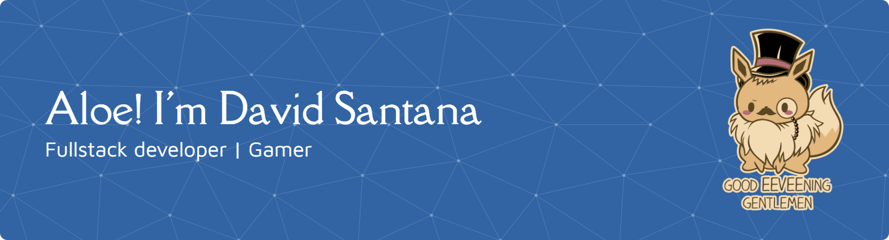

# 💫 About Me:
#### Aloe, I'm David Santana 👋 
 I’m a full-stack developer, part-time bug whisperer, and occasional overthinker of variable names. Most of my projects were born from caffeine highs, curiosity dives, long debugging sessions, and a suspiciously high number of visits to Stack Overflow.  I write clean code (or at least code that looks clean after three refactors), and I enjoy building things that actually work—preferably on the first try, but realistically, after a few “why is this not working?!” moments.  If you’re into maintainable software, clever solutions, and occasional commit messages like `fix: it finally works don’t ask me why`, feel free to scroll around or reach out. Also, if you find a weird bug in one of my repos… congratulations, you’ve just unlocked a bonus feature 🐞✨  Those things definitely weren’t written by AI… unless AI is getting way too good at this 🤖🤓 
##### Here's some things you might want to know about me:
- 🔭 I’m currently working on a POS project (it's still underway, so no peeking!)
- 🌱 I’m currently learning **Laravel** and **ReactJS** among other things while working on my projects

## 🌐 Let's get in touch:
     

## 💻 See what I can do:
                   

### ✍️ Random Dev Quote

<!-- Proudly created with GPRM ( https://gprm.itsvg.in ) -->